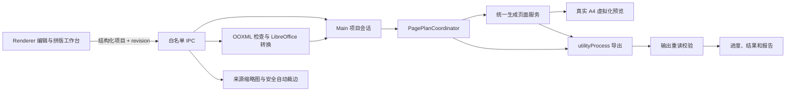

# 系统架构

## 1. 进程职责

### Main

负责 BrowserWindow、安全策略、项目会话、对话框、文件导入、OOXML 检查、Office 转换调度、校验、PagePlan 协调、打印窗口、缓存协议、后台导出和系统打开操作。

### Preload

通过 `contextBridge` 暴露 `window.supportPack`。API 按 project、import、preview、export、system 和 app 分组，不暴露 `ipcRenderer`、`fs`、`path`、`shell` 或任意通道发送器。

### Renderer

React、Ant Design 和 Zustand 负责结构化项目编辑、选择状态、操作历史、虚拟化预览、拼版工作台和进度界面。拼版工作台只编辑 `layoutSheets` 结构化配置；Renderer 不读取文件、不持有 PDF/图片/Office 二进制、不启动转换程序、不合并 PDF，也不自行决定最终页面顺序。

### 隐藏打印窗口

安全 BrowserWindow 加载本地 React 打印页面，通过 HTML/CSS 排版封面、目录和标题页，再调用 `webContents.printToPDF` 生成 A4 PDF。

### Utility Process

`pdf-export-worker.cjs` 在 Electron utilityProcess 中逐页执行 PDF/图片转换、合并、页码、元数据和输出校验。Main 与子进程只传递结构化请求、路径、进度和结果。

### Worker Threads

两个并发槽的缩略图队列使用 worker_threads。PDF.js 与 `@napi-rs/canvas` 渲染 PDF，Sharp 生成 WebP 缓存。来源页缩略图与自动裁边都通过稳定 `sourcePageId` 和当前 `planFingerprint` 请求；Main 从项目会话解析真实路径，不向 Renderer 返回路径。

### Office 转换进程

`ConversionManager` 以并发 1 串行调度 `LibreOfficeConversionAdapter`。适配器只使用打包内固定 `soffice` 路径和参数数组启动子进程，不经过 shell；每个任务拥有独立用户配置目录，支持 180 秒超时、AbortSignal 取消、进度和清理。转换成功后先重读 PDF 并校验页数，再允许进入导入确认阶段。

## 2. IPC 边界

所有通道在 `src/shared/constants/ipc.ts` 固定声明。主进程处理程序执行：

1. 校验发送者 webContents ID。
2. 校验主 frame URL，仅接受本地自定义协议或开发服务器。
3. 用 Zod 完整解析输入。
4. 捕获异常并返回统一 `Result<T, AppError>`。

错误对象提供中文阶段、原因和可操作建议；本地路径不通过 URL 参数公开。

拼版新增的受控预览调用只接受 `sourcePageId`、当前 `planFingerprint`、有界缩略图宽度和自动裁边安全边距。Main 会拒绝旧计划、未知来源页、越界宽度和非法安全边距。自动裁边返回 0–10000 的归一化矩形，不返回来源二进制或文件路径。

## 3. 数据流



项目修改使 revision 增加。PagePlan 请求约 350 ms 防抖；重算期间保留上一套缩略图，旧 revision 或旧 `planFingerprint` 的结果不会覆盖新状态。导出前先保存项目并重新生成稳定计划。

## 4. 文件流

copy 模式：

```text
用户选择文件 -> Main 校验/哈希 -> assets 临时复制 -> 原子改名
-> project.json 相对路径 -> 缩略图缓存 -> 导出临时目录 -> 最终 PDF
```

reference 模式只保存外部绝对路径，但每次打开、预览和导出前重新检查。`.spack` 导出会把 reference 来源复制到包内并改写为 copy 模式。

Office 文件增加一条受控分支：

```text
DOCX/PPTX/XLSX -> OOXML ZIP 安全检查 -> temp/import-<taskId>
-> LibreOffice PDF 快照校验 -> 用户确认
-> 原件按 copy/reference 保存 + 快照原子写入 assets/conversions
-> 后续作为 PDF 内容页进入 PagePlan
```

取消、失败或导入会话过期时会清理分析目录。便携包同时包含 Office 原件和转换快照；清理缓存不会删除 `assets/conversions`。

## 5. PagePlan

`buildPagePlan` 是两阶段的唯一权威计算：

1. 按启用状态、页码范围、删除状态和实际内容页确定 canonical 来源页、输出材料与有效祖先节点。
2. 校验并应用 `layoutSheets`：拼版锚点替换首个来源页，其他已使用来源页不再生成普通独占页面。
3. 只对有效输出生成一级 `一、`、二级 `（一）`、材料 `1.` 序号，再生成页面、目录和页码映射。

它统一处理：

- 目录、材料和页面排序
- 父级与材料启用状态、空目录排除和输出 ID 集合
- 节点/材料序号映射、纯标题和最终显示文本
- 页码范围和稳定 sourcePageId
- 页面重排、旋转和删除
- 封面、目录、分类页、材料标题页
- 封面背面空白页与内容页同页分级标题
- 物理索引与逻辑页码
- 节点/材料起止页
- TOC 条目
- 普通内容页与 `compositeContent` 拼版页
- 拼版区段、递归横/纵拆分、来源槽、裁切、适配、对齐和布局摘要
- 拼版冲突、缺失槽、跨目录确认和清晰度门禁
- 错误、警告与 fingerprint

左侧树、同页标题、独立标题页、目录、预览和导出共用编号格式化器与 PagePlan，不保存手工序号。拖拽只修改 `order`，随后整套序号即时派生。没有实际输出的目录显示“未输出”，不占序号。内容页只允许在同一材料内拖拽。

一级目录没有独立分类页时，其起始逻辑页由第一个启用的后代节点或材料回推。`inlineHeadings` 使用一级、二级、材料三级语义，并随 planFingerprint 一起变化。

封面字段在新建项目时从项目属性复制一次，之后独立保存。项目属性修改不会回写封面；封面缩略图与最终 PDF 均读取 `coverSettings`。姓名、单位、用途为空时生成页面不保留空行。

### 拼版布局树

项目的 `layoutSheets` 是持久化的用户意图，不是另一份 PagePlan。每张拼版纸包含：

- A4 方向、页边距、区段/槽位间距、锚点来源页和规范顺序。
- 一个或多个全宽成果区段；跨成果时各区段保存材料 ID、标题显示规则和高度权重。
- 递归 `row`/`column` 拆分树；分支使用总和为 10000 的整数权重。
- 叶子槽位；保存稳定 `sourcePageId`、归一化裁切框、适配方式、九宫格对齐、附加旋转和清晰度确认。

同一来源页只能作为一个主槽出现；“原图＋细节”通过 `detailOf` 明确允许第二个裁切视图。自动建议受项目槽位上限约束，超出容量时创建更多拼版纸，不截断页面。跨二级目录必须保存用户确认。

PagePlan 会把每个有效布局解析成 `CompositePagePlan`，并用布局摘要加入 fingerprint。未确认的低清晰度槽、孤儿材料、未知来源、重复主槽、非连续选择或错误锚点会阻止导出。缺失单页保留为错误槽以便用户修复；删除整项材料或目录时 Renderer 的共享清理函数会移除对应区段并重新归一化。

预览、最终 PDF 和输出校验读取同一个 `CompositePagePlan`。Renderer 中的工作台预览仅用于编辑反馈，不能替代真实 A4 合成结果。

## 6. 状态与历史

Zustand 保存项目结构、revision、dirty、PagePlan、选择和最多 50 步历史，不保存大型二进制。修改停止 1.5 秒后自动保存；失败时 dirty 保持为真。

## 7. 异常处理

服务抛出具体中文错误，IPC 层包装为用户错误。electron-log 保存脱敏堆栈。导出服务将失败、取消和成功明确区分；主进程在子进程异常退出时返回独立错误。
