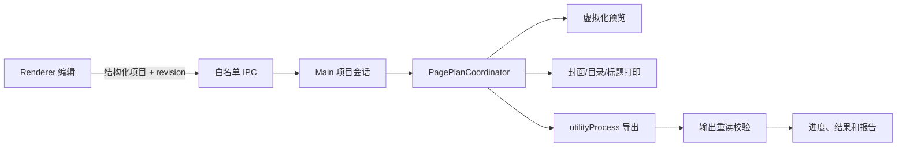

# 系统架构

## 1. 进程职责

### Main

负责 BrowserWindow、安全策略、项目会话、对话框、文件导入、校验、PagePlan 协调、打印窗口、缓存协议、后台导出和系统打开操作。

### Preload

通过 `contextBridge` 暴露 `window.supportPack`。API 按 project、import、preview、export、system 和 app 分组，不暴露 `ipcRenderer`、`fs`、`path`、`shell` 或任意通道发送器。

### Renderer

React、Ant Design 和 Zustand 负责结构化项目编辑、选择状态、操作历史、虚拟化预览和进度界面。Renderer 不读取文件、不持有 PDF/图片二进制、不合并 PDF。

### 隐藏打印窗口

安全 BrowserWindow 加载本地 React 打印页面，通过 HTML/CSS 排版封面、目录和标题页，再调用 `webContents.printToPDF` 生成 A4 PDF。

### Utility Process

`pdf-export-worker.cjs` 在 Electron utilityProcess 中逐页执行 PDF/图片转换、合并、页码、元数据和输出校验。Main 与子进程只传递结构化请求、路径、进度和结果。

### Worker Threads

两个并发槽的缩略图队列使用 worker_threads。PDF.js 与 `@napi-rs/canvas` 渲染 PDF，Sharp 生成 WebP 缓存。

## 2. IPC 边界

所有通道在 `src/shared/constants/ipc.ts` 固定声明。主进程处理程序执行：

1. 校验发送者 webContents ID。
2. 校验主 frame URL，仅接受本地自定义协议或开发服务器。
3. 用 Zod 完整解析输入。
4. 捕获异常并返回统一 `Result<T, AppError>`。

错误对象提供中文阶段、原因和可操作建议；本地路径不通过 URL 参数公开。

## 3. 数据流



项目修改使 revision 增加。PagePlan 请求约 350 ms 防抖；旧 revision 的结果不会覆盖新状态。导出前先保存项目并重新生成稳定计划。

## 4. 文件流

copy 模式：

```text
用户选择文件 -> Main 校验/哈希 -> assets 临时复制 -> 原子改名
-> project.json 相对路径 -> 缩略图缓存 -> 导出临时目录 -> 最终 PDF
```

reference 模式只保存外部绝对路径，但每次打开、预览和导出前重新检查。`.spack` 导出会把 reference 来源复制到包内并改写为 copy 模式。

## 5. PagePlan

`buildPagePlan` 统一处理：

- 目录、材料和页面排序
- 父级与材料启用状态
- 页码范围和稳定 sourcePageId
- 页面重排、旋转和删除
- 封面、目录、分类页、材料标题页
- 封面背面空白页与内容页同页分级标题
- 物理索引与逻辑页码
- 节点/材料起止页
- TOC 条目
- 错误、警告与 fingerprint

预览、目录和导出不得另写排序规则。内容页只允许在同一材料内拖拽。

一级目录没有独立分类页时，其起始逻辑页由第一个启用的后代节点或材料回推。`inlineHeadings` 使用一级、二级、材料三级语义，并随 planFingerprint 一起变化。

## 6. 状态与历史

Zustand 保存项目结构、revision、dirty、PagePlan、选择和最多 50 步历史，不保存大型二进制。修改停止 1.5 秒后自动保存；失败时 dirty 保持为真。

## 7. 异常处理

服务抛出具体中文错误，IPC 层包装为用户错误。electron-log 保存脱敏堆栈。导出服务将失败、取消和成功明确区分；主进程在子进程异常退出时返回独立错误。
